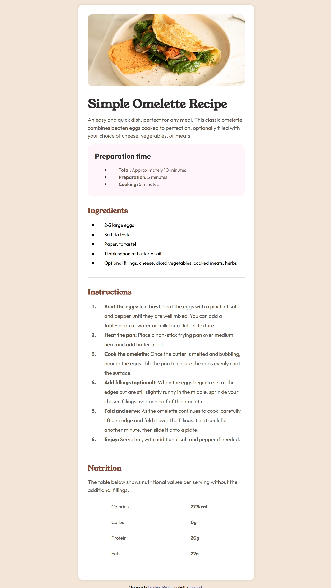

# Frontend Mentor - Recipe page solution

This is a solution to the [Recipe page challenge on Frontend Mentor](https://www.frontendmentor.io/challenges/recipe-page-KiTsR8QQKm). Frontend Mentor challenges help you improve your coding skills by building realistic projects.

## Table of contents

- [Overview](#overview)
  - [Screenshot](#screenshot)
  - [Links](#links)
- [My process](#my-process)
  - [Built with](#built-with)
  - [What I learned](#what-i-learned)
  - [Useful resources](#useful-resources)
- [Author](#author)
- [Acknowledgments](#acknowledgments)

## Overview

### Screenshot



### Links

- Solution URL: [Add solution URL here](https://your-solution-url.com)
- Live Site URL: [Add live site URL here](https://your-live-site-url.com)

## My process

### Built with

- Semantic HTML5 markup
- CSS custom properties
- Flexbox
- Mobile-first workflow
- Custom Fonts (Young Serif and Outfit)
- Responsive Design

### What I learned

During this project, I learned several key concepts:

1. Working with custom fonts and implementing them using @font-face:

```css
@font-face {
  font-family: "Young Serif";
  src: url("./assets/fonts/young-serif/YoungSerif-Regular.ttf") format("truetype");
}
@media screen and (max-width: 768px) {
  main {
    width: 100%;
    padding: 2rem;
    margin: 0;
    border-radius: 0;
  }
}
:root {
  --Stone-100: hsl(30, 54%, 90%);
  --Stone-600: hsl(30, 10%, 34%);
  --Brown-800: hsl(14, 45%, 36%);
}
```

### Useful resources

- [CSS Custom Properties Guide](https://developer.mozilla.org/en-US/docs/Web/CSS/CSS_cascading_variables/Using_CSS_custom_properties) - This helped me understand how to effectively use CSS variables.
- [CSS Flexbox Guide](https://css-tricks.com/snippets/css/a-guide-to-flexbox/) - An excellent resource for understanding Flexbox layout.
- [Media Queries](https://developer.mozilla.org/en-US/docs/Web/CSS/CSS_media_queries) - This helped me implement responsive design effectively.

## Author

- Frontend Mentor - [@Shashank23codes](https://www.frontendmentor.io/profile/Shashank23codes)
- Linkdin - [Shashank Gupta](https://www.linkedin.com/in/shashank-gupta-238a96209)

## Acknowledgments

Thanks to [Frontend Mentor](https://www.frontendmentor.io) for providing this challenge and helping me improve my front-end development skills.